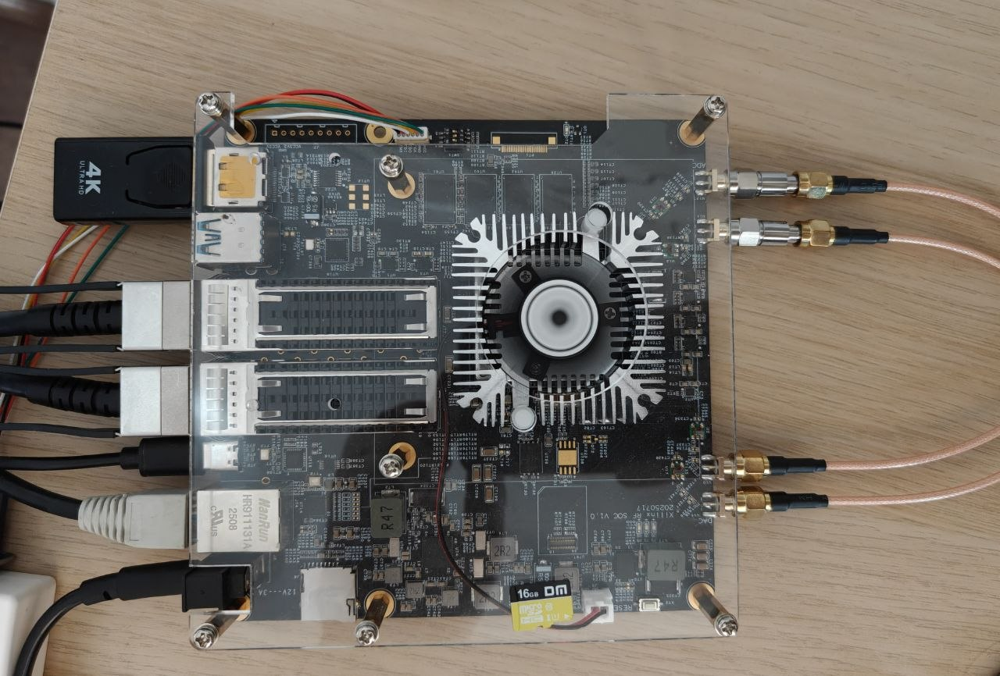
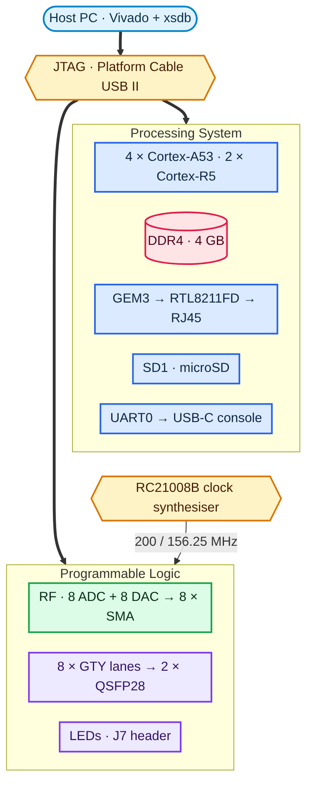
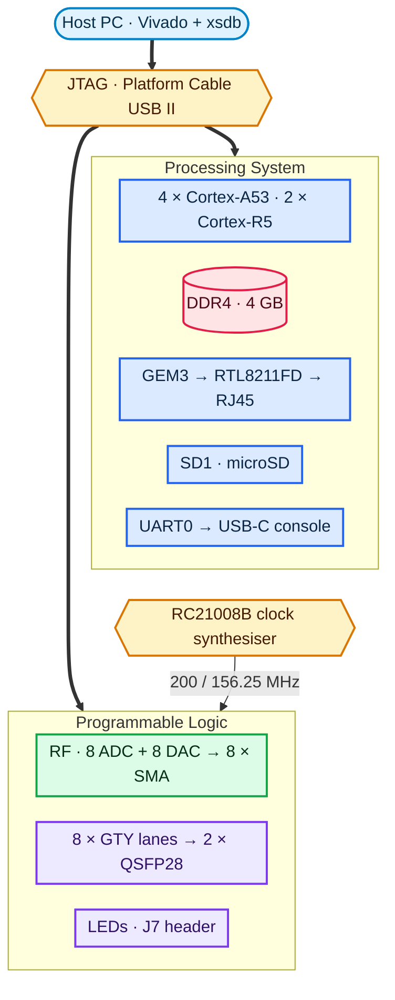

# XCZU27DR RFSoC — Board Support Package



*The board as everything here was tested on it: SMA coax looping the DAC
outputs back into the ADC inputs, both QSFP28 cages in the middle, gigabit
Ethernet and the USB-C console down the left side, and a rather serious fan
over the RFSoC itself.*

A board support package for the **Xilinx Zynq UltraScale+ RFSoC XCZU27DR**
(`xczu27dr-fsve1156-1-i`, revision v1.1) — pin map, worked examples, and a page
of notes per interface, written while bringing the board up one piece at a time.

**Every folder here has scripts you can just run.** Tcl that builds what it
needs, programs the board over JTAG, exercises the interface and tells you
plainly whether it worked. Alongside each one is a page covering the pins, the
registers, and the traps that'll otherwise cost you an afternoon.

The pin map was read off the schematic and checked against a routed build. The
processor configuration is written out from board parameters in plain Tcl. The
RF and transceiver designs come from AMD's own IP. You need the board, a JTAG
cable and Vivado — nothing else.

---

## What's on the board



<details>
<summary>Diagram source (Mermaid)</summary>



</details>

| | |
|---|---|
| Device | XCZU27DR-FSVE1156-1-I, RFSoC Gen 1 |
| RF ADC | 4 dual tiles — ADC224/225/226/227, 8 inputs |
| RF DAC | 2 quad tiles — DAC228/229, 8 outputs |
| Memory | 4 GB DDR4, 4 × MT40A512M16JY, DDR4-2400P |
| Ethernet | GEM3 → RTL8211FD, RGMII, PHY at MDIO address 7 |
| Transceivers | 8 GTY lanes, 2 quads → 2 × QSFP28 |
| Reference clock | RC21008B, I²C programmable |
| Console | UART0 on MIO42/43 → CH340E on USB-C **JT9**, 115200 8N1 |
| Boot | SD1, `BOOT.BIN` from the first FAT partition |

---

## The folders

| Folder | Interface | Start with | Status |
|---|---|---|---|
| [`jtag/`](jtag/) | JTAG chain, DAP, register access | `xsdb jtag_check.tcl` | ✅ working |
| [`leds/`](leds/) | 3 user LEDs and the J7 header | `vivado -mode batch -source led_test.tcl` | ✅ working |
| [`ddr4/`](ddr4/) | PS DDR4, calibration and memory test | `vivado -mode batch -source build.tcl`, then `xsdb ddr4_test.tcl` | ✅ working |
| [`ethernet/`](ethernet/) | Gigabit Ethernet, GEM3 + RTL8211FD | `vivado -mode batch -source build.tcl`, then `ZU27DR_NIC=<nic> xsdb eth_verify.tcl` | ✅ working |
| [`clocking/`](clocking/) | RC21008B and the GTY reference clocks | `vivado -mode batch -source clock_check.tcl` | ✅ working |
| [`qsfp/`](qsfp/) | QSFP28 cages, module I²C, GTY lanes | `vivado -mode batch -source qsfp_test.tcl` | ✅ working |
| [`adc-dac/`](adc-dac/) | RF converters, tone out and capture back | `vivado -mode batch -source build.tcl`, then the four steps on that page | ✅ working |

Most of those are a single command that does the whole job. Three aren't, and
it's worth knowing which before you start: `ddr4/` and `ethernet/` need their
`build.tcl` run once to write a `psu_init`, and `adc-dac/` is a four-step
sequence because a waveform has to be generated before it can be played. Each
page spells out its own order, and every script tells you which step you skipped
rather than simply falling over.

There's also **[`ZU27DR_v1.1.xdc`](ZU27DR_v1.1.xdc)** at the top level — the full
board constraint file, covering every programmable-logic pin the board actually
connects. That's 136 I/O across banks 65, 66, 88 and 89, plus the eight GTY
reference clock balls and the quad placement. Every line carries the schematic
net name, the Xilinx pin name and the destination connector in a comment, so you
can check any of it against the schematic without hunting for it.

A ✅ means that interface was brought up on this board, with the script in that
folder, and the numbers it produced are on that folder's page.

You'll notice there's no "untested" row. That's deliberate. USB, DisplayPort,
SD-FEC, the I²C power tree and the SD card boot flow are all real parts of this
board and none of them has been exercised here yet. Rather than write pages
guessing at them from the schematic, they're simply absent. They'll get folders
when they've been made to work, and not before.

### What was actually measured

| | |
|---|---|
| JTAG | full chain, DAP read/write across OCM, boot mode reads `0x5` = SD1 |
| LEDs A10 / D12 / H14 | lit in sequence, confirmed as silkscreen **DT1 / DT5 / DT4** |
| Banks 88 / 89 rail | **3.3 V**, traced on the schematic and confirmed on silicon |
| DDR4 | **12 of 12** PHY training stages, `PGSR0 0x80004FFF`, patterns hold, no aliasing |
| Ethernet | 1000 Mb full duplex, PHY@7, 8 frames sent, **8 received good, 0 CRC errors** |
| GTY reference clocks | **156.2500 MHz** on refclk0 of both quads, counts equal to within one |
| QSFP cages | both `ModPrsL` and `IntL` correct, all 6 control outputs, **both I²C buses read their module** |
| QSFP GTY lanes | **all 8 links at 10.3125 Gbps, PRBS-31, zero bit errors** |
| RF loopback | **125.00 MHz** and **375.00 MHz**, both at −21.3 dBFS, each landing in exactly the right FFT bin |

Every one of those numbers came out of a design this repository builds itself.

---

## Getting started

You'll need three things:

- **Vivado and Vitis 2025.2**, with `vivado`, `xsdb` and `xsct` on your `PATH`.
  2021.2 works too.
- **A JTAG cable.** These pages assume a Xilinx Platform Cable USB II, which is
  what the board was brought up with.
- **The board in JTAG boot mode.** Almost everything here either runs purely in
  the programmable logic or drives the processor directly over the debug port,
  so there's no SD card, no boot image and no serial console to set up first.

Begin with [`jtag/`](jtag/). If that doesn't pass, nothing else will, and it's
written to tell you why rather than just failing.

```bash
cd jtag && xsdb jtag_check.tcl
```

After that, take the folders in whatever order interests you — each stands
alone, with its own RTL, its own constraints and its own build. The first run of
a folder that needs a bitstream takes a few minutes; after that it reuses what
it built.

One thing worth knowing before you go looking for trouble: if you're heading for
the transceivers or the RF converters, read [`clocking/`](clocking/) first.
There's a programmable clock chip on this board that has to be set up before
either of those will do anything at all, and the failure mode looks alarmingly
like dead silicon.

## A word on the family resemblance

This board isn't a ZCU111 and it isn't a ZCU208. It's close enough to both that
their documentation is genuinely useful, and different enough that following it
blindly will cost you time.

The differences that actually bite are small and specific: the Ethernet PHY
address, which converter tiles reach connectors, which SD controller is wired
up. Wherever one of those matters, the relevant page says so outright rather
than leaving you to find out for yourself.
