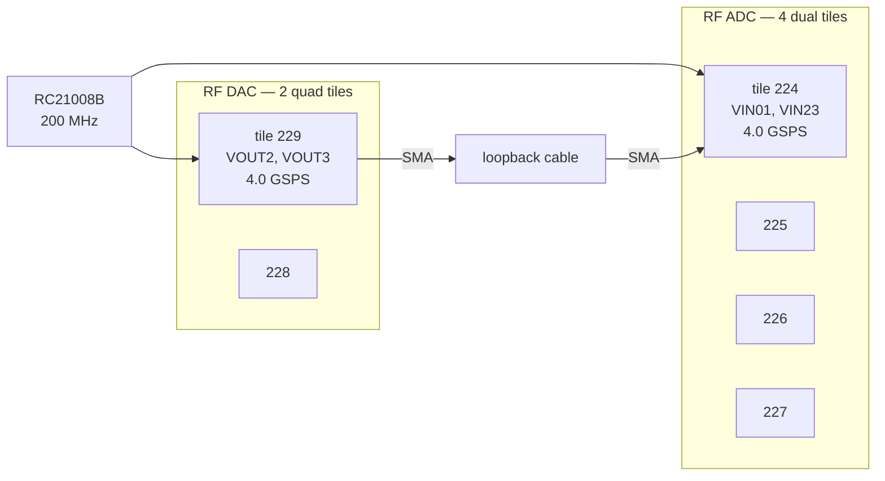

# RF data converters

**Status: ✅ working.**

This is the reason you bought an RFSoC rather than an ordinary UltraScale+
part, so it's satisfying that it works. Tones played out of the DACs come back
on the ADCs at exactly the right frequency, through an example design this
folder generates from AMD's own IP:

| tone | measured | level | SFDR | worst spur |
|---|---|---|---|---|
| DAC12 → VIN01 | **125.00 MHz** | −21.2 dBFS | **53.0 dB** | 2000.00 MHz |
| DAC13 → VIN23 | **375.00 MHz** | −21.2 dBFS | **61.1 dB** | 1286.13 MHz |

Both active tiles report `POWERED_UP` and `PLL_LOCKED` at restart state 15:

```
   ADC0   status 0x00002eef  state 15   supplies_up POWERED_UP PLL_LOCKED
   DAC1   status 0x0000c44f  state 15   supplies_up POWERED_UP PLL_LOCKED
   ADC1/2/3, DAC0   POWERED_UP, no PLL   <- correct, this design does not enable them
```

```bash
cd adc-dac
vivado -mode batch -source build.tcl        # once, 40 to 60 minutes
vivado -mode batch -source rfdc_status.tcl  # what state are the tiles in?

python3 gen_waveform.py                     # writes out/waveform.tcl
vivado -mode batch -source loopback.tcl     # play and capture
python3 analyze.py out/capture.txt          # FFT and report
python3 plot_capture.py out/capture.txt     # picture
```

Fair warning on that build: it's the slow one in this repository. The design
closes timing at **+0.011 ns** worst negative slack, and the critical path is
inside the example design's own ILA running at 500 MHz rather than anything
this BSP adds.

---

## What's on the board



| | |
|---|---|
| ADC | 4 dual tiles — ADC224, 225, 226, 227 — 8 inputs in total |
| DAC | 2 quad tiles — DAC228, 229 — 8 outputs in total |
| Reference | **200 MHz** from the RC21008B to both active tiles |
| Sampling | **4.0 GSPS**, tile PLL × 20 from that 200 MHz reference |
| Sample format | **14-bit, left-aligned in 16 bits** |
| DAC output | 20 mA full scale, which needs `DAC_AVTT` at 2.5 V |

The design built here enables **ADC tile 224** and **DAC tile 229**, which are
the two that reach SMA connectors on this board. The other tiles report powered
but unlocked. That's correct rather than a fault, and worth remembering before
you go looking for a problem.

## The sample format trap

ADC samples are **14-bit, left-aligned in a 16-bit word**. The bottom two bits
are always zero, and full scale is `0x7FFC`, not `0x1FFF`.

Read them as right-aligned 14-bit values and everything comes out 12 dB too
quiet, which looks exactly like a broken converter. The out-of-range word shows
up as `0xFFFC` for the same reason. This one is easy to get wrong and slow to
notice.

## DAC_AVTT and ball A12

The 20 mA full-scale setting needs the `DAC_AVTT` rail sitting at 2.5 V. On
this board that rail is switched by a FET whose **gate is ball A12**, and
**driving it low selects 2.5 V**. There's no external pull-down on that gate.

The RFDC example design doesn't drive A12 at all, so if something else in your
design pulls it high you get 3.0 V and a different full scale. If you want a
device-wide safety net for this, `../ZU27DR_v1.1.xdc` carries a commented-out
`BITSTREAM.CONFIG.UNUSEDPIN PULLDOWN` aimed at exactly this pin. Read the note
next to it first, because it applies to every bank on the device.

## What the example design gives you

AMD's RF Data Converter IP ships an example design containing the converter
block, a MicroBlaze, a JTAG-to-AXI master, and block RAMs that feed the DACs
and capture from the ADCs. That amounts to a complete RF test bench with no
processor involvement at all.

It's what these scripts drive, through the JTAG-to-AXI master, from the Vivado
hardware manager. No MicroBlaze software to compile, no RF Analyzer GUI, and no
Windows machine required.

### Memory map

Confirmed by probing the hardware rather than read out of any document. The
offsets can move between IP versions, so `build.tcl` writes out the map it
actually generated into `build/addrmap.tcl` and the scripts prefer that over
their built-in defaults. As it happens, on 2025.2 the generated map came out at
the same addresses the 2021.2 design used, which are the ones below.

| window | default base | contents |
|---|---|---|
| RFDC registers | `0x44B0_0000` | 256 K |
| `dac_source` | `0xC000_0000` | playback memories, 4 M |
| `adc_sink` | `0xE000_0000` | capture memories, 4 M |

Both data windows use a **32 KB block stride**:

```
dac_source  +0x00000 cfg   +0x08000 DAC10  +0x10000 DAC11
                           +0x18000 DAC12  +0x20000 DAC13
adc_sink    +0x00000 cfg   +0x08000 ADC0 (VIN01)  +0x10000 ADC2 (VIN23)
```

Config words sit at the base of each window:

| offset | |
|---|---|
| `0x00` | id |
| `0x04` | start |
| `0x08` | enable |
| `0x0C` | tile enable |
| `0x10 + 4n` | `num_samples[n]` |

## Tile status

`rfdc_status.tcl` reads and decodes every tile. Restart state 15 means the tile
finished its power-up sequence, which is what you want to see.

A tile stuck below 15 hasn't got its reference clock. On this board that
almost always means the RC21008B was never programmed, because that's the
FSBL's job rather than the fabric's. [`../clocking/`](../clocking/) explains
what to do about it, and it's the first thing to check if nothing locks.

## Wiring the loopback

One SMA cable from a DAC output to an ADC input.

`gen_waveform.py` writes **two different tones**, one per DAC channel, which
means a single cable identifies itself: whichever tone turns up on whichever
ADC channel tells you which pair you actually connected. Small thing, saves a
lot of squinting at connectors.

| | |
|---|---|
| DAC side | only **VOUT2** and **VOUT3** of tile 229 reach connectors |
| ADC side | **VIN01** and **VIN23** of tile 224 |

The generated tones sit at 1/32 and 3/32 of the 4.0 GSPS sample rate, so
125 MHz and 375 MHz, at half full scale. That leaves the ADC comfortable
headroom rather than pushing it near clipping.

## Reading the FFT

`analyze.py` prints the peak bin, its level in dBFS, and the spurious-free
dynamic range. What you should see is one tone per channel, at the frequency
that channel was given, and nothing else above roughly −45 dBFS.

A word on what those SFDR numbers mean. The 53.0 dB and 61.1 dB at the top of
this page are what a bare SMA cable between two connectors on the same board
produces. That's a loopback measurement, not a converter specification: it
includes the cable, both connectors, and whatever the board's own grounding is
doing. Treat it as a "this path works correctly" figure rather than as
something to compare against a datasheet.

`plot_capture.py` draws the same data as a time-domain trace and a spectrum.
Both scripts print the capture file they read, which is worth glancing at once
you've run more than one capture and lost track of which is which.
