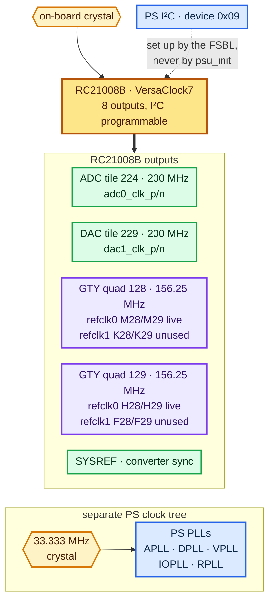

# Clocking — the RC21008B

**Status: ✅ working.**

Two of the four GTY reference inputs carry exactly 156.25 MHz, and the other two
carry nothing at all. That sounds like half a failure. It's precisely what this
board's clock profile is meant to do:

```
   quad 128 refclk0   M28 / M29       156.2500 MHz   count 3383218   +0.0000%
   quad 128 refclk1   K28 / K29     no clock
   quad 129 refclk0   H28 / H29       156.2500 MHz   count 3383219   +0.0000%
   quad 129 refclk1   F28 / F29     no clock (count 1 -- stray edges on a floating input)
```

Two notes on reading that. The counts move a little between runs because
`CFGMCLK` drifts with temperature; only the ratio is meaningful, and the ratio is
exact. And a dead input doesn't always latch a clean zero — left floating it
picks up the odd edge from its neighbours, so you may see a count of one or two.
That's about 50 Hz. Anything under 1000 counts is reported as no clock, with the
stray count shown rather than quietly hidden.

Both live channels come back with the same count to within one, so they're the
same frequency to within one cycle in 3.4 million — and that one count is the
gate quantisation, not a difference between the two clocks.

The RF reference path is proven separately, and rather more convincingly: both
converter tiles report `PLL_LOCKED` and a loopback tone lands in exactly the bin
it should.

```bash
cd clocking
vivado -mode batch -source clock_check.tcl
vivado -mode batch -source clock_check.tcl -tclargs 161.1328125   # 25G profile
```

The first run builds `build/clk_meas_top.bit`, about four minutes, then programs
it and reports all four reference clocks.

> ⚠️ **Boot the board's FSBL before you run this**, or you'll be measuring an
> unprogrammed clock chip and wondering why the numbers are nonsense. The next
> section explains why, and it's the single most useful thing on this page.

---

## The clock tree



| | |
|---|---|
| Part | **RC21008B** VersaClock7, Renesas / IDT, 8 outputs |
| Programmed by | the FSBL, over I²C, at device address `0x09` |
| RF reference | **200 MHz** to both active converter tiles |
| GTY reference | **156.25 MHz** for 10G, about 161.13 MHz for 25G |
| PS reference | a separate **33.333 MHz** crystal, nothing to do with the RC21008B |

## The thing that catches everyone

This clock chip is set up by the FSBL and by nothing else. On a board that's only
ever been JTAG-booted it has simply never been configured — and you can watch the
difference directly. Same board, same bitstream, ten minutes apart:

| | before any FSBL ran | after the FSBL ran |
|---|---|---|
| quad 128 refclk0 | no clock | **156.25 MHz** |
| quad 128 refclk1 | no clock | no clock |
| quad 129 refclk0 | ~400 MHz | **156.25 MHz** |
| quad 129 refclk1 | no clock | no clock |

So a freshly powered board has one output free-running at some default rate and
three completely dead. If you load a fabric-only bitstream and find the RF tiles
won't lock, or the transceivers won't come up: **the board isn't broken.** Nothing
has told the clock chip what to do yet.

The fix is simply to let an FSBL run once per power cycle — off the SD card, or
over JTAG with `dow fsbl.elf`. The chip keeps its configuration until the power
goes off, so you only need to do it once, and you can reprogram the fabric as
many times as you like afterwards.

You can see the ordering in the boot log. The clock chip reports *before* the
FSBL prints its own banner, because it's brought up very early in
initialisation:

```
rc21008a init finish
Xilinx Zynq MP First Stage Boot Loader
Release 2021.2   Aug 27 2025  -  10:46:27
SD1 Boot Mode
```

And to head off the obvious idea: running a `psu_init` isn't enough. The ones
[`../ddr4/`](../ddr4/) and [`../ethernet/`](../ethernet/) generate contain no I²C
writes whatsoever — that's been checked, the count is zero — because Vivado has
no idea this board has a clock chip on it. They bring up DDR and Ethernet
perfectly happily and leave the GTY references exactly as they found them.

## How the measurement works, and what it can honestly tell you

Each reference clock pair goes through an `IBUFDS_GTE4`, comes out of `ODIV2` at
half rate, through a `BUFG_GT` into the fabric, and into a counter. All four
counters run for the same gate window, which is 2²¹ cycles of `STARTUPE3`'s
internal oscillator.

```
f_refclk = 2 × count × f_cfgmclk / 2²¹
```

Now the honest part. **`CFGMCLK` is specified only as 30–65 MHz**, so the
absolute frequencies inherit that error, and there's nothing to be done about it
from inside the chip. This board has no accurate time base in the fabric.

**The ratios, on the other hand, are exact**, because every channel shares one
gate. So the script takes one channel as a known reference — 156.25 MHz by
default, or whatever you pass on the command line — back-solves the oscillator
frequency from it, and reports the other three against that. Those three numbers
are only as good as your assumption about the first, but the percentages between
channels are correct regardless.

The script also prints the implied `CFGMCLK` and fails outright if it lands
outside 30–65 MHz, since that means your assumed reference was wrong. On this
board it works out at **48.4 MHz**, comfortably mid-range — a nice independent
sign that the whole measurement is sane.

### One subtlety that produced a wrong answer for a while

All four counters are captured on the same clock edge, but the host reads them
one AXI transaction at a time, and over JTAG those are milliseconds apart. With a
new capture landing every gate period, a set of four reads can straddle a
boundary and end up mixing two different measurement windows.

That showed up as a frequency ratio error between the two live channels of
−0.04%, then −0.10%, then +0.02% on successive runs. Small enough to look like a
genuine difference between two clock outputs. It wasn't.

The fix is that every word now carries the sequence number of the capture it came
from in its top 7 bits, and the script rejects any set of reads whose sequence
numbers don't all match. With that in place the two channels agree to within a
single count, every run — and that last count is just the gate boundary landing
between two edges, which no amount of sequencing removes.

| result | meaning |
|---|---|
| count 0, or a handful | no clock arriving on that pin pair — a floating input picks up a stray edge or two |
| equal counts | the same frequency, exactly — what refclk0 of both quads gives |
| one channel off | that RC21008B output is programmed differently |

**Two of the four inputs having no clock is normal here**, not a fault. The
profile that gets loaded drives refclk0 of each quad and leaves refclk1
unconnected. Both quads still get a usable reference, which is all any transceiver
design needs — see [`../qsfp/`](../qsfp/), where IBERT runs off exactly these two.

## Register map

| address | |
|---|---|
| `0x44A0_0000` | quad 128 refclk0 count, `M28` / `M29` |
| `0x44A0_0008` | quad 128 refclk1 count, `K28` / `K29` |
| `0x44A1_0000` | quad 129 refclk0 count, `H28` / `H29` |
| `0x44A1_0008` | quad 129 refclk1 count, `F28` / `F29` |

Each word is a 7-bit capture sequence number in bits `[31:25]` and a 25-bit count
in bits `[24:0]`. A new capture lands roughly every 85 ms.

## The stronger evidence for the RF reference

Nothing in this folder measures the 200 MHz going to the converter tiles. Those
are dedicated RF inputs rather than fabric clocks, so a counter in the fabric
simply can't see them.

The proof is downstream instead, and it's considerably stronger than a frequency
count anyway:

```
ADC0  status 0x00008eef  state 15  POWERED_UP PLL_LOCKED
DAC1  status 0x0000264f  state 15  POWERED_UP PLL_LOCKED
```

together with a tone played at a known DAC bin coming back on the ADC at
**125.00 MHz** and **375.00 MHz**, which is exactly where it belongs. A wrong
reference frequency would move both of those proportionally, and an absent one
would stop the PLL locking at all. See [`../adc-dac/`](../adc-dac/).

## If you reprogram the synthesiser

The RC21008B takes a configuration over I²C, and there are two profiles in common
use on this board: 156.25 MHz for 10G and about 161.13 MHz for 25G.

If you switch between them, remember the timing constraints have to follow.
`../ZU27DR_v1.1.xdc` and `clk_meas.xdc` both declare a 6.400 ns period for the GTY
reference clocks, which is the 156.25 MHz case.
