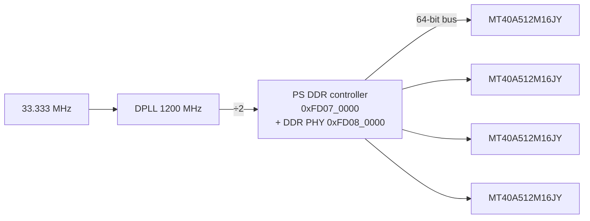

# PS DDR4 memory

**Status: ✅ working.**

Four gigabytes of DDR4 hanging off the processor's hardened memory controller.
All twelve PHY training stages complete with no errors, and read/write patterns
hold across the address range with every address distinct.

```bash
cd ddr4
vivado -mode batch -source build.tcl    # once, a couple of minutes
xsdb ddr4_test.tcl
```

The result below comes from the `psu_init` that `build.tcl` generates out of
the parameters further down this page. No boot image and no SD card involved —
this runs on a bare board over JTAG:

```
== PGSR0 (0xFD080030) = 0x80004FFF
   all 12 training stages PASS, no errors
   [31] APLOCK  PHY analog PLL lock   locked
== memory test
   0x00100000  all 5 patterns OK          0x40000000  all 5 patterns OK
   0x10000000  all 5 patterns OK          0x7FE00000  all 5 patterns OK
   0x20000000  all 5 patterns OK
== RESULT: DDR4 PASSED
```

Worth saying plainly: those twelve stages passing is the whole proof. DDR
training either works or it doesn't, and it won't complete against wrong
geometry or wrong timings. If the parameters further down were off, you would
see it here immediately.

---

## What's fitted



| | |
|---|---|
| Devices | 4 × **MT40A512M16JY**, 512 M × 16, 8 Gbit each |
| Bus | 64-bit, built out of ×16 devices |
| Speed bin | **DDR4-2400P**, CL15-15-15 |
| Total | **4 GB** |
| ECC | none, and there's nowhere to put it — these are plain components, not a DIMM with a spare device |
| DDR clock | DPLL 1200 MHz ÷ 2 = **600 MHz**, giving 1200 MT/s × 2 = DDR4-2400 |

### Address map

| range | |
|---|---|
| `0x0000_0000` – `0x7FEF_FFFF` | low ~2 GB |
| `0x7FF0_0000` – `0x7FFF_FFFF` | **reserved by the PMU**, leave it alone |
| `0x8_0000_0000` – `0x8_7FFF_FFFF` | high 2 GB |

If you're writing a device tree, that makes the memory node
`<0x0 0x0 0x0 0x7ff00000>` plus `<0x8 0x0 0x0 0x80000000>`. Which happens to be
exactly what a ZCU111 uses, so a ZCU111 device tree needs no change here at all.

## The geometry, and how it adds up

These are the numbers `build.tcl` sets. It's worth being able to check them by
hand, because getting one wrong shows up as a training failure that looks for
all the world like a hardware fault.

```
16 row bits + 10 column bits + 2 bank bits + 1 bank-group bit
  = 2^29 addresses × 16 bits = 8 Gbit   -> one MT40A512M16JY die
64-bit bus / 16-bit devices             -> 4 devices
4 × 8 Gbit                              -> 4 GB
```

| parameter | value |
|---|---|
| row / column / bank / bank-group | 16 / 10 / 2 / 1 |
| CL / CWL | 15 / 12 |
| tRCD / tRP / tRC | 15 / 15 / 44.5 ns |
| tRAS min / tFAW | 32.0 / 30.0 ns |
| address mapping | `ROW_BANK_COL` |
| PS reference crystal | 33.333 MHz |

## Why there's no logic in the fabric

Because a DDR4 test doesn't need any.

The memory controller, the DDR PHY and the calibration engine are all hardened
silicon inside the processor. There's no MIG core to instantiate, nothing from
the fabric in the data path, and nothing the block design can get wrong except
the parameters in the table above.

So `build.tcl` never runs synthesis at all. It configures the processor,
generates the IP's output products, and copies out the `psu_init.tcl` that
Vivado writes as a side effect. That's why this folder builds in two minutes
while the others take rather longer.

## Reading the result

`ddr4_test.tcl` runs that `psu_init` over JTAG, doing exactly what an FSBL
would do, and then decodes `PGSR0` at `0xFD08_0030`, the DDR PHY General Status
Register. Bits `[11:0]` are the training stages:

| bit | | bit | |
|---|---|---|---|
| 0 | initialization | 6 | DQS gate training |
| 1 | PLL lock | 7 | write levelling adjustment |
| 2 | digital delay line calibration | 8 | read bit deskew |
| 3 | impedance (ZQ) calibration | 9 | write bit deskew |
| 4 | DRAM initialization | 10 | read eye training |
| 5 | write levelling | 11 | write eye training |

They run in order, which makes a failure genuinely informative. **The first
stage listed as not done is where it stopped**, and nothing after it ever ran.
So read that stage name as a hint about where to look:

- **PLL lock** points at the reference clock, not the memory.
- **DRAM initialization** points at the address and command wiring, or at the
  geometry above being wrong.
- **write levelling** or **DQS gate training** point at the data byte lanes.

Bits `[30:18]` are the matching error flags. The field names and the error mask
both come from Xilinx's own PMU firmware, `zynqmp_pmufw/src/pm_ddr.c`, and the
"all twelve done bits" expectation is what `psu_init` itself polls for:
`poll 0xFD080030 0x00000FFF 0x00000FFF`.

## Calibration passing isn't the same as memory working

The script goes on to actually use the memory, and it should.

A partially trained bus can report every stage done and still quietly fold two
addresses onto the same storage. So after the register decode, the script
writes five patterns at five addresses, and then writes a **distinct value per
address** and reads them all back. That second step is the one that catches
aliasing, and it's the reason this is a memory test rather than a register
dump.

## Two traps

**`mrd -value` returns decimal on some xsdb builds and hex on others**, with no
`0x` to say which you got.

This one bit hard. On 2026-08-26 a perfectly healthy `PGSR0` of `0x80004FFF`
came back as the decimal string `2147504127`, got parsed as hex, and produced
the impossible 40-bit value `0x2147504127`. That decoded as seven failed
training stages and six errors, so a passing board was reported as a hard
failure. Every script here parses the labelled `mrd` form and range-checks the
result against 32 bits.

**The DIP switch doesn't have to be in the JTAG position.** DDR training was
confirmed with the boot mode straps set to SD1 and the boot ROM failing.
`psu_init` over JTAG doesn't care in the slightest what the boot ROM was
trying to do.

## If you need eye margins

Pass or fail is all this folder gives you. If you want to know how much timing
and voltage room the trained interface actually has, build the **DRAM
Diagnostics** application in Vitis against this same `psu_init`. That runs a
real 2D eye scan, and nothing you can do over JTAG substitutes for it.
