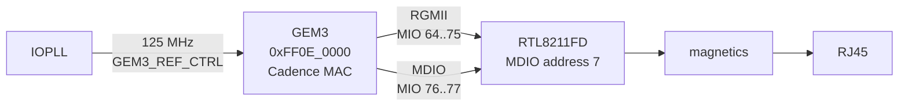

# Gigabit Ethernet — GEM3 and the RTL8211FD

**Status: ✅ working.**

The link comes up at 1000 Mb full duplex, and eight frames put on the wire by
GEM3 were counted by the host's own network card as **eight good frames with
zero CRC errors**. That last detail matters more than it sounds like it does,
for reasons explained below.

```bash
cd ethernet
vivado -mode batch -source build.tcl          # once, a couple of minutes
ZU27DR_NIC=<nic> xsdb eth_verify.tcl
```

Put the board in JTAG boot mode and run an Ethernet cable from it straight into
the host network card you named. You don't need an IP address on that
interface — the test sends raw frames and counts them. No SD card, no boot
image, no serial console.

Here's what a passing run looks like, using the `psu_init` that `build.tcl`
generates. No boot image, no SD card — it comes up on a bare board over JTAG:

```
== GEM3_REF_CTRL 06010C00  RST_LPD_IOU0 00000007 (bit3=gem3 rst)
== net_ctrl 00000010  net_cfg 00300000 (management port up)
== PHY@7  id2 0x001C  BMCR 0x1040  BMSR 0x79A9
== link up at 1000Mb   reg0x11 0x0109 (strapped 0x0109)   host link 1000 Mb/s
== MAC transmitted 8   host received 8 good, 0 CRC errors
== ETHERNET PASS
```

That last line is the one that counts. The host's own network card accepted
all eight frames with a correct FCS, which no amount of self-reported MAC
statistics can fake.

---

## The path



| | |
|---|---|
| MAC | **GEM3**, the fourth of the four Cadence MACs in the processor |
| RGMII | MIO 64–75 |
| MDIO | MIO 76–77, clause 22 |
| PHY | **Realtek RTL8211FD** at MDIO address **7** |
| Reference clock | 125 MHz from IOPLL, `GEM3_REF_CTRL` = `0x06010C00` |
| Speeds | 10 / 100 / 1000 |

> **The PHY is at address 7.** A ZCU111 puts it at 0x0C. If you're starting
> from ZCU111 material, and device trees especially, this is the one line you
> have to change: the `ethernet-phy@7` node and the `phy-handle` that points at
> it.

## Three things that fail silently

This is the section worth reading before you write any of your own MAC setup
code.

**GEM3 will cheerfully increment `frames_transmitted` while absolutely nothing
reaches the wire.** Three pieces of state decide whether it genuinely
transmits, and not one of them complains when it's missing:

| register | offset | value used here | what goes wrong without it |
|---|---|---|---|
| `dma_config` | `0x010` | `0x00180710` | INCR16 burst, 8 K RX buffer, TX store-and-forward |
| `laddr1` | `0x088` / `0x08C` | any valid MAC | transmit is dropped with no source address set |
| `receive_q_ptr` | `0x018` | a real ring | left at reset with RX enabled, the DMA wedges |

The last one is the really unpleasant one, because an unconfigured **receive**
pointer stops **transmit**. Queue 1 does the same thing, which is why the
script parks queue 1's pointers on dummy used descriptors.

There's a fourth trap of a slightly different kind:

> **The management port has to be enabled before your first MDIO access.** Set
> the MDC divider in `net_cfg[20:18]` and the enable bit in `net_ctrl[4]`,
> *then* talk to the PHY. Do it in the other order and every MDIO register
> reads back `0x0000`, which looks exactly like a missing or dead PHY and will
> send you hunting for a hardware fault that's not there.

## The PHY delay register

On the `RTL8211FD`, page `0xd08` register `0x11` holds the RGMII TX delay. The
strapped value on this board is **`0x0109`**, and it needs to stay that way:

| value | result |
|---|---|
| `0x0109` | correct — strapped, and what works |
| `0x0009` | frames arrive with a wrong FCS |
| `0x0100` | transmit stops dead |

Realtek PHYs use paged registers, so the sequence is: write the page number to
register 31, access your register, write 0 back to register 31. The script does
that and always restores page 0 afterwards.

## Why the test reads the host's counters

Because anything the board says about itself is weak evidence, and on this MAC
it's actively misleading.

The script snapshots `/sys/class/net/<nic>/statistics/rx_packets` and
`rx_crc_errors` before and after, sends a fixed number of frames, and then
insists all three numbers agree: GEM3's own transmit count, the host's
good-frame count, and zero CRC errors.

That third number is what caught the `0x0009` delay failure. A frame with a bad
FCS increments the host's `rx_crc_errors` and not `rx_packets`, so a test that
only counted packets would have called it a pass.

The frames go out as broadcast with Ethertype `0x88B5`, a value IEEE reserves
for local experimental use, carrying an ASCII payload. So they're easy to
spot on the host.

## Watching it from the host

```bash
sudo tcpdump -i <nic> -e -X ether proto 0x88b5
```

## Getting an IP stack running

`eth_verify.tcl` proves the physical path works. It doesn't give you a socket.

For that you need software running on the board, and the usual first step is a
Vitis lwIP echo application, or else Linux. Neither is in this folder. The lwIP
route needs a Vitis application build and Linux needs an SD card, and while
both work on this board, neither has been taken end to end here yet. This
repository documents what has actually been done.

## Register cheat sheet

GEM3 lives at `0xFF0E_0000`.

| offset | register |
|---|---|
| `0x000` | `net_ctrl` — bit 2 RX enable, 3 TX enable, 4 mgmt port enable, 9 start TX |
| `0x004` | `net_cfg` — bit 0 speed 100, 1 full duplex, 10 gigabit, [20:18] MDC divider |
| `0x008` | `net_status` — bit 2 MDIO idle |
| `0x010` | `dma_config` |
| `0x014` | `tx_status` |
| `0x018` | `receive_q_ptr` |
| `0x01C` | `transmit_q_ptr` |
| `0x034` | `phy_maint` — MDIO read and write |
| `0x088` / `0x08C` | `laddr1` low / high |
| `0x108` | `frames_transmitted` |
| `0x158` | `frames_received` |
| `0x440` / `0x480` | queue 1 RX / TX pointers |
