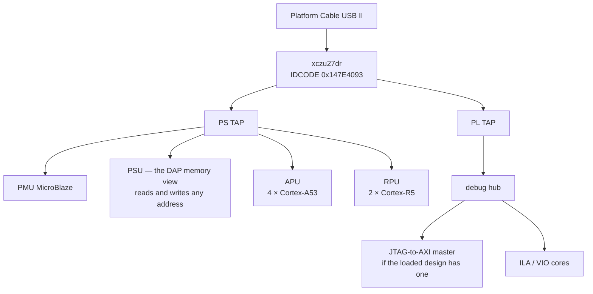

# JTAG

**Status: ✅ working.**

JTAG is how this whole board got brought up. Before there was any Linux on it,
JTAG is what loaded bitstreams, ran bare-metal code, and read or wrote any AXI
or processor register you cared to name. It's the foundation everything else
here sits on.

So run this one first. If it doesn't pass, nothing else will, and the script
is written to tell you why rather than just falling over.

```bash
cd jtag
xsdb jtag_check.tcl
```

```
   xczu27dr found, IDCODE 147e4093
   present : PSU, PMU, APU core 0, APU core 3, RPU core 0
== DAP memory access
   6 patterns and 8 distinct addresses across OCM, all correct
== boot mode
   BOOT_MODE_USER = 0x00000005  ->  mode 5 = SD1
== RESULT: JTAG PASSED. Chain, DAP and memory access all work.
```

---

## What's on the chain



A healthy enumeration looks roughly like this:

```
  1  xczu27dr
  2  PS TAP
     3  PMU
     4  PL
  5  PSU
     6  RPU (Reset)
     9  APU
       10  Cortex-A53 #0 (Running)
```

If you've other FPGA cables plugged into the same machine, they show up in
this list as well. That's why the script matches on the part name instead of
counting positions.

## What the script actually checks

| step | check | why it matters |
|---|---|---|
| 1 | a chain was scanned and it has an xczu27dr on it | tells "no cable" apart from "no board" |
| 2 | PSU, PMU, APU and RPU targets enumerate | the Arm debug port answering, which is a different path from step 1 |
| 3 | patterns and distinct values through on-chip RAM | proves the debug port can move data, not just enumerate |
| 4 | boot mode straps, decoded | tells you which boot device the DIP switch picked |
| 5 | PL configuration status | whether a bitstream is currently loaded |

Step 3 deliberately uses on-chip RAM at `0xFFFC0000` rather than DDR. OCM is
powered and usable with no DDR, no FSBL and no boot whatsoever, which is
exactly the state the board is in under JTAG boot mode. Nothing is running, so
scribbling on it's harmless. It wouldn't be harmless while an FSBL or U-Boot
was live, but in that situation you wouldn't be running this script.

## Boot mode

The straps land in `CRL_APB.BOOT_MODE_USER` at `0xFF5E0200`, bits `[3:0]`.
Decoding follows UG1085 table 11-1:

| value | mode | | value | mode |
|---|---|---|---|---|
| `0000` | JTAG | | `0101` | **SD1** ← this board's normal setting |
| `0001` | QSPI 24-bit | | `0110` | eMMC 1.8 V |
| `0010` | QSPI 32-bit | | `0111` | USB0 |
| `0011` | SD0 | | `1000` | PJTAG0 |
| `0100` | NAND | | `1110` | SD1 level-shifted |

This board reads back `0x00000005`, which is SD1. That agrees with what the
board says about itself on the console, where the FSBL prints `SD1 Boot Mode`
and `File name is 1:/BOOT.BIN` before its own banner.

## Things worth knowing before they catch you

**`connect` comes back before the chain has been scanned.** The hw_server
polling thread needs a few seconds to open the cable. Ask for `targets` any
sooner and you get an empty list from a perfectly healthy cable, which looks
exactly like a dead board. The `after 3000` in the script isn't padding.

**`mrd -value` returns decimal on some xsdb builds and hex on others**, with no
`0x` to tell you which you got. Parse it with `scan %x` and it corrupts the
value silently, which is about the worst way for a bug to behave. Every script
in this BSP parses the labelled `mrd` form instead. Look at `read32` if you
want to borrow it.

**Writes to processor registers need the security gates open first.** The magic
incantation is `mwr 0xFFCA0038 0x1FF`, which opens LPD peripheral protection.
Skip it and your writes are dropped without complaint while reads come back as
zero.

**`rst -system` re-enters the boot ROM.** This reboots the board from JTAG
without anyone having to reach for the power switch, which is handy when the
board lives somewhere awkward.

**Several cables on one host break more than you would expect.** With more than
one FPGA cable attached, xsdb's `fpga` command reports "Multiple FPGA devices
found" and gives up, and `device status config_status` refuses to pick a device
even after you've selected a target. Neither failure says anything at all
about this board.

The way around it's to program through Vivado's hardware manager, which is
what every bitstream-loading script here does. `jtag_check.tcl` handles the
second case by falling back to inferring PL configuration from whether a debug
hub shows up on the chain.

## Poking at things by hand

```bash
# read a processor register through the debug port
xsdb -eval 'connect; after 3000
            targets -set -filter {name =~ "*PSU*"}
            mwr 0xFFCA0038 0x1FF
            mrd 0xFF0E0000'

# run some bare-metal code on A53 #0
xsdb -eval 'connect; after 3000
            targets -set -filter {name =~ "*Cortex-A53*#0*"}
            rst -processor; after 1000; stop
            dow your_app.elf
            con'
```

One gotcha with that second one: `dow` fails with *"Can't flush CPU cache …
EDITR not ready"* if the core is still running. Reset the processor first, as
shown above.
