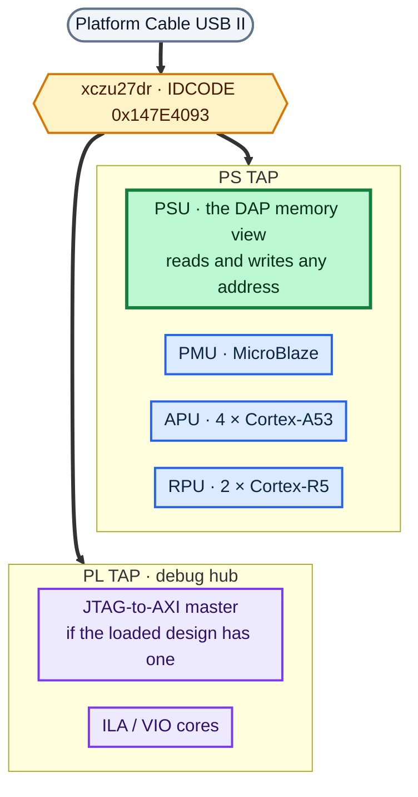

# JTAG

**Status: ✅ working.**

JTAG is how this whole board got brought up. Long before there was any Linux on
it, JTAG was what loaded bitstreams, ran bare-metal code, and read or wrote any
AXI or processor register you cared to name. Everything else in this repository
sits on top of it.

Which is why you should run this one first. If it doesn't pass, nothing else
will — and the script is written to tell you *why* rather than just falling
over.

```bash
cd jtag
xsdb jtag_check.tcl
```

```
   xczu27dr found, IDCODE 147e4093
   present : PSU, PMU, APU core 0, APU core 3, RPU core 0
== DAP memory access
   6 patterns and 8 distinct addresses across OCM, all correct
== boot mode
   BOOT_MODE_USER = 0x00000005  ->  mode 5 = SD1
== RESULT: JTAG PASSED. Chain, DAP and memory access all work.
```

---

## What's on the chain



`PSU` is highlighted because it's the one you'll use most — it's the memory view
that lets you read and write any address on the chip without a single line of
software running.

A healthy enumeration looks roughly like this:

```
  1  xczu27dr
  2  PS TAP
     3  PMU
     4  PL
  5  PSU
     6  RPU (Reset)
     9  APU
       10  Cortex-A53 #0 (Running)
```

If you've got other FPGA cables plugged into the same machine they'll show up in
that list too, which is exactly why the script matches on the part name instead
of counting positions.

## What the script actually checks

| step | check | why it matters |
|---|---|---|
| 1 | a chain was scanned and it has an xczu27dr on it | tells "no cable" apart from "no board" |
| 2 | PSU, PMU, APU and RPU targets enumerate | the Arm debug port answering, which is a different path from step 1 |
| 3 | patterns and distinct values through on-chip RAM | proves the debug port can move data, not just enumerate |
| 4 | boot mode straps, decoded | tells you which boot device the DIP switch picked |
| 5 | PL configuration status | whether a bitstream is currently loaded |

Step 3 deliberately uses on-chip RAM at `0xFFFC0000` rather than DDR. OCM is
powered and usable with no DDR, no FSBL and no boot whatsoever — which is
precisely the state the board is in under JTAG boot mode. Nothing's running, so
scribbling on it is harmless. It would *not* be harmless while an FSBL or U-Boot
was live, but in that situation you wouldn't be running this script anyway.

## Boot mode

The straps land in `CRL_APB.BOOT_MODE_USER` at `0xFF5E0200`, bits `[3:0]`.
Decoding follows UG1085 table 11-1:

| value | mode | | value | mode |
|---|---|---|---|---|
| `0000` | JTAG | | `0101` | **SD1** ← this board's normal setting |
| `0001` | QSPI 24-bit | | `0110` | eMMC 1.8 V |
| `0010` | QSPI 32-bit | | `0111` | USB0 |
| `0011` | SD0 | | `1000` | PJTAG0 |
| | | | `1001` | PJTAG1 |
| `0100` | NAND | | `1110` | SD1 level-shifted |

This board reads back `0x00000005`, which is SD1 — and that agrees with what the
board says about itself on the console, where the FSBL prints `SD1 Boot Mode`
and `File name is 1:/BOOT.BIN` before its own banner.

## Things worth knowing before they catch you

**`connect` comes back before the chain has been scanned.** The hw_server
polling thread needs a few seconds to open the cable. Ask for `targets` any
sooner and you'll get an empty list from a perfectly healthy cable — which looks
exactly like a dead board. The `after 3000` in the script isn't padding.

**`mrd -value` returns decimal on some xsdb builds and hex on others**, with no
`0x` to tell you which you got. Parse it with `scan %x` and it corrupts the value
silently, which is about the worst way for a bug to behave. Every script in this
BSP parses the labelled `mrd` form instead — borrow `read32` if you want it.

**Writes to processor registers need the security gates open first.** The magic
incantation is `mwr 0xFFCA0038 0x1FF`, which opens LPD peripheral protection.
Skip it and your writes get dropped without complaint while reads come back as
zero.

**`rst -system` re-enters the boot ROM.** That reboots the board from JTAG
without anyone reaching for the power switch, which is handy when the board
lives somewhere awkward.

**Several cables on one host break more than you'd expect.** With more than one
FPGA cable attached, xsdb's `fpga` command reports "Multiple FPGA devices found"
and gives up, and `device status config_status` refuses to pick a device even
after you've selected a target. Neither failure says anything at all about this
board.

The way around it is to program through Vivado's hardware manager, which is what
every bitstream-loading script here does. `jtag_check.tcl` handles the second
case by falling back to inferring PL configuration from whether a debug hub
shows up on the chain.

## Poking at things by hand

```bash
# read a processor register through the debug port
xsdb -eval 'connect; after 3000
            targets -set -filter {name =~ "*PSU*"}
            mwr 0xFFCA0038 0x1FF
            mrd 0xFF0E0000'

# run some bare-metal code on A53 #0
xsdb -eval 'connect; after 3000
            targets -set -filter {name =~ "*Cortex-A53*#0*"}
            rst -processor; after 1000; stop
            dow your_app.elf
            con'
```

One gotcha with that second one: `dow` fails with *"Can't flush CPU cache …
EDITR not ready"* if the core is still running. Reset the processor first, as
shown above.
