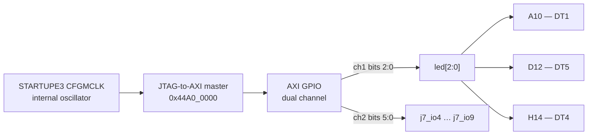

# User LEDs and the J7 header

**Status: ✅ working.**

Three LEDs and six header pins. Not the most glamorous interface on an RFSoC
board, but it's the one you reach for constantly: an LED you can turn on from
a script is the fastest way to prove a bitstream really loaded and the fabric
is really running.

Getting here also settled an argument. Example code for this board disagrees
with itself about the I/O voltage on these exact pins, and one version is wrong
in a way that could damage a bank. That story is further down.

```bash
cd leds
vivado -mode batch -source led_test.tcl
```

The first run builds `build/led_top.bit`, which takes a few minutes on a part
this size, then programs it and walks the pins. Later runs reuse the bitstream.

The automated part passes on hardware:

```
== AXI self-test
   LED channel  all patterns read back correctly
   J7 channel   all patterns read back correctly
== AXI SELF-TEST PASSED
```

After that the script lights each LED on its own so you can check it against
the silkscreen, then drives each J7 pin high in turn so you can find it with a
meter. Those two are yours to confirm by looking; no script can do it for you.

The LED-to-silkscreen mapping below was confirmed by eye, separately, using a
plain RTL blink design. The J7 pin order is read from the schematic and the
AXI path to it's proven, but nobody has yet put a probe on the header to
confirm the physical ordering.

---

## Pins



| signal | ball | schematic net | silkscreen | I/O standard |
|---|---|---|---|---|
| `led[0]` | `A10` | `HD89_IO_P3` | **DT1** | LVCMOS33 |
| `led[1]` | `D12` | `HD88_IO_N8` | **DT5** | LVCMOS33 |
| `led[2]` | `H14` | `HD88_IO_N2` | **DT4** | LVCMOS33 |

The LEDs are anode-fed, so driving the pin high is what lights them.

### J7, the only free probeable pins on the module

Everything else that's not already committed to something disappears into the
bottom-side carrier connector. J7 is on top, and you can get a probe on it.

| J7 pin | ball | net | also on |
|---|---|---|---|
| 1 | — | **+5 V** | — |
| 2 | — | **GND** | — |
| 3 | — | **+3.3 V** | — |
| 4 | `K15` | `HD88_IO_P1` | JT2.1 |
| 5 | `K14` | `HD88_IO_N1` | JT2.3 |
| 6 | `J14` | `HD88_IO_P3` | JT2.5 |
| 7 | `J13` | `HD88_IO_N3` | JT2.7 |
| 8 | `J12` | `HD89_IO_N12` | JT2.9 |
| 9 | `K12` | `HD89_IO_P12` | JT2.11 |

> Pins 1, 2 and 3 are power and ground. Don't short them, and don't put
> anything on them that drives.

## The bank voltage question, settled

This is the part worth reading even if you never touch an LED.

You'll come across example constraint files for this board that declare
`LVCMOS18` on balls `A10` and `H14`, and others that declare `LVCMOS33` on the
same two balls. They can't both be right, and driving a 1.8 V bank at a 3.3 V
standard is a good way to damage it. So which is it?

The schematic answers cleanly. Bank 88 VCCO (`E13`, `H12`) and bank 89 VCCO
(`D10`, `G9`) both sit on the net `VCC_ADJ`. That net has exactly one source
anywhere on the board: `VCC_3V3`, through ferrite bead `LT14`. There's an
alternate feed through `LT13`, but it's marked NC.

**Banks 88 and 89 are 3.3 V, so `LVCMOS33` is the correct one.**

The insidious part is that the wrong setting still works. The output stage
swings to whatever VCCO actually is, and Vivado has no way of knowing the board
rail without a board file, so it builds without complaint and the LEDs light up
normally. Nothing tells you anything is amiss. That's exactly why the mistake
survives in code people hand around.

Confirmed on silicon afterwards: the LEDs light and behave correctly at
`LVCMOS33`.

## Register map

There's one dual-channel AXI GPIO sitting behind a JTAG-to-AXI master. Both
channels are outputs, so reading a data register gives you back what you last
wrote. That's what the script's self-test checks, before it asks you to look
at anything with your eyes.

| address | | bits |
|---|---|---|
| `0x44A0_0000` | channel 1 data | `[2:0]` = `led[2:0]` |
| `0x44A0_0004` | channel 1 tri | fixed, all outputs |
| `0x44A0_0008` | channel 2 data | `[5:0]` = `j7_io9` … `j7_io4` |
| `0x44A0_000C` | channel 2 tri | fixed, all outputs |

## Driving it yourself

Once `led_test.tcl` has programmed the board, that same map is reachable from
any Vivado hardware-manager session:

```tcl
open_hw_manager
connect_hw_server -allow_non_jtag
open_hw_target
current_hw_device [lindex [get_hw_devices xczu27dr*] 0]
refresh_hw_device -update_hw_probes false [current_hw_device]

set m [lindex [get_hw_axis] 0]
create_hw_axi_txn -force w $m -address 44A00000 -data 00000007 -type write
run_hw_axi [get_hw_axi_txns w]      ;# all three LEDs on
```

## Why the clock comes from STARTUPE3

This design has no external clock and no processor block, so it needs to find a
clock somewhere. `STARTUPE3` provides one: `CFGMCLK`, the internal
configuration oscillator. It's always running, depends on nothing outside the
chip, and is nominally 50 MHz — though the datasheet only promises somewhere
between 30 and 65 MHz.

That vagueness makes it useless as a time base and perfectly fine for an AXI
bus you poke at over JTAG.

Because `CFGMCLK` can't be trusted to a known frequency, this design
deliberately doesn't put timed waveforms on J7. It sets one pin at a time and
holds it, so you identify pins with a meter rather than by measuring a
frequency that might be 30% off.
