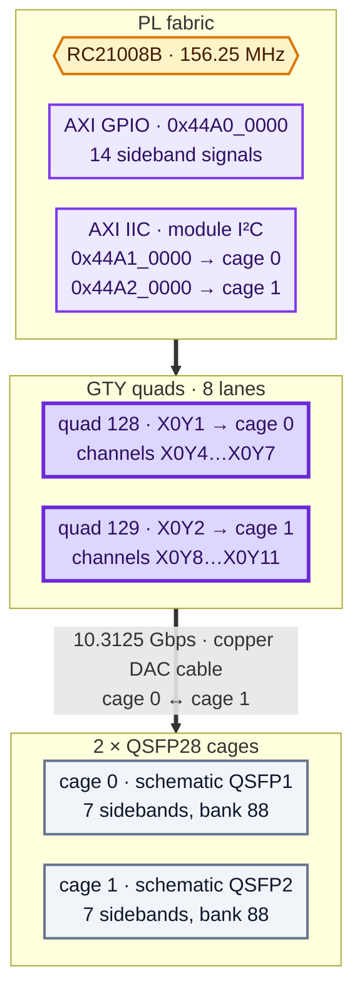

# QSFP28 cages and GTY transceivers

**Status: ✅ working — sidebands, module I²C and all eight lanes.**

Both cages have been exercised on hardware with a QSFP28 passive copper cable
looping cage 0 to cage 1. Every sideband pin behaves, and each cage's I²C bus
independently reads the identity of whichever end of the cable is plugged into
it:

```
   cage 0  ModPrsL=0 -> MODULE PRESENT       IntL=1 -> no interrupt
   cage 1  ModPrsL=0 -> MODULE PRESENT       IntL=1 -> no interrupt
   ...
   == CONTROL TEST PASSED
   cage 0  vendor : OEM     part : DAC-QSFP28-1M
   cage 1  vendor : OEM     part : DAC-QSFP28-1M
```

Pull one end out and that cage's `ModPrsL` flips to "no module fitted" while the
other stays exactly where it was — which is the pin mapping confirming itself,
without anyone having to take the schematic on trust.

```bash
cd qsfp
vivado -mode batch -source qsfp_test.tcl
```

The first run builds `build/qsfp_top.bit` — about five minutes — then programs
it, reads both cages, exercises every control output, and reads any fitted module
over I²C. Add `-tclargs noprog` to re-test without reprogramming.

**The high-speed lanes pass too.** All eight of them, PRBS-31 at 10.3125 Gbps
through the same cable, with not one bit error:

```
   link                   locked       bit errors          BER
   cage0.0 -> cage1.0     yes                   0     9.66e-12
   cage1.0 -> cage0.0     yes                   0     9.55e-12
   cage0.1 -> cage1.1     yes                   0     9.47e-12
   cage1.1 -> cage0.1     yes                   0     9.37e-12
   cage0.2 -> cage1.2     yes                   0     9.28e-12
   cage1.2 -> cage0.2     yes                   0     9.18e-12
   cage0.3 -> cage1.3     yes                   0     9.09e-12
   cage1.3 -> cage0.3     yes                   0     9.00e-12
== RESULT: GTY PASS
```

To be precise about what that BER column means: it's simply 1 / bits received,
which is the bound you can claim when the error count is zero. It is not a
measured error rate — you can't measure a rate of zero. The default ten-second
dwell at 10.3125 Gbps is about 10¹¹ bits per link, and not one of them came back
wrong. The figures drift down the column because each link is read a moment later
than the one above it, so it's accumulated slightly more bits. Run
`-tclargs dwell 60` if you want a tighter bound.

---

## How a cage is wired


<details>
<summary>Diagram source (Mermaid)</summary>



</details>

The two cages sit on **independent I²C buses**, which is why the test design
carries two controllers rather than one behind a mux.

## Sideband pins

All fourteen live in bank 88, which is a 3.3 V bank — see [`../leds/`](../leds/)
for how that got settled. `scl` and `sda` are open drain with 4k7 pull-ups to
`QSFP_VCCT` fitted on the board, so drive them through an IOBUF and never drive
them high.

| QSFP28 pin | signal | direction | cage 0 ball | cage 1 ball | pull-up |
|---|---|---|---|---|---|
| 8 | `ModSelL` | out, active low | `A14` | `G12` | — |
| 9 | `ResetL` | out, active low | `B13` | `F13` | — |
| 11 | `SCL` | open drain | `B12` | `D13` | 4k7 |
| 12 | `SDA` | open drain | `A13` | `F12` | 4k7 |
| 27 | `ModPrsL` | in, active low | `C14` | `F14` | 4k7 |
| 28 | `IntL` | in, active low | `D14` | `H13` | 4k7 |
| 31 | `LPMode` | out, active high | `E14` | `G13` | — |

> ⚠️ **Watch the naming if you borrow constraints from elsewhere.** You'll find
> these four control signals named inconsistently across example files for this
> board, including one that calls cage 1's `ResetL` **`qsfp2_resetn`**. There is
> no cage 2 — the schematic labels them `QSFP1` and `QSFP2`, and that name is
> simply a typo. This BSP uses `qsfp0_*` and `qsfp1_*` throughout, with cage 0
> being the one whose lanes run to GTY quad 128.

## GTY reference clocks

| quad | input | P | N |
|---|---|---|---|
| 128 | refclk0 | `M28` | `M29` |
| 128 | refclk1 | `K28` | `K29` |
| 129 | refclk0 | `H28` | `H29` |
| 129 | refclk1 | `F28` | `F29` |

All four come from the RC21008B, which is I²C programmable, so the reference
frequency is a configuration choice rather than a board constant. The usual
profiles are 156.25 MHz for 10G and about 161.13 MHz for 25G.
[`../clocking/`](../clocking/) measures what's actually present, which on this
board is refclk0 of each quad and nothing on the refclk1 inputs.

Lane TX and RX balls need no `PACKAGE_PIN` of their own; they follow from the
channel `LOC`.

## Register map

| address | | |
|---|---|---|
| `0x44A0_0000` | GPIO ch1, control | bit 0 cage0 reset, 1 cage0 modsel, 2 cage0 lpmode, 3–5 the same for cage 1 |
| `0x44A0_0008` | GPIO ch2, status | bit 0 cage0 `ModPrsL`, 1 cage0 `IntL`, 2 cage1 `ModPrsL`, 3 cage1 `IntL` |
| `0x44A1_0000` | AXI IIC, cage 0 | PG090 register map |
| `0x44A2_0000` | AXI IIC, cage 1 | PG090 register map |

The control bits read as **assert-high** even though the pins themselves are
active low. That inversion lives in the RTL deliberately: the GPIO powers up with
its data register at zero, and zero parks the cages safely with `ResetL` high,
`ModSelL` high and `LPMode` low. Nothing gets driven into a module before you ask
for it.

The status bits, by contrast, are **raw pin levels** — so `ModPrsL` reading 0
means a module *is* present. The script does the decoding; the register doesn't.

## Reading a module

QSFP28 modules answer at 7-bit I²C address `0x50`, which is the same thing as
`0xA0` written as an 8-bit address, and the layout is SFF-8636:

| byte | contents |
|---|---|
| 0 | identifier — `0x0C` QSFP, `0x0D` QSFP+, `0x11` QSFP28 |
| 127 | page select for bytes 128–255 |
| 148–163 | vendor name, ASCII, space padded |
| 168–183 | vendor part number, ASCII |

**`ModSelL` has to be driven low before the module will answer.** The script does
that, reads, and releases it again.

Two things turned up doing this with a cheap cable, and both are worth knowing:

- **The whole lower page can read `0xFF`.** On the DAC-QSFP28-1M tested here,
  bytes 0–127 come back as all `0xFF`, identifier included, while the upper page
  returns perfectly clean ASCII vendor and part strings. That's the module, not
  the reader: addressing that reached byte 148 correctly reached byte 0 too.
  Partial SFF-8636 compliance is common on passive copper, so don't treat a
  missing identifier as a failed read.
- **Don't reset the I²C core between transfers.** `SOFTR` drops the core mid-bus
  while the module is still clocking out a byte. The module then holds SDA low
  waiting for a clock that never arrives, and every read after that times out.
  Reset once per cage, then do as many reads as you like.

## Testing the lanes

```bash
vivado -mode batch -source ibert_test.tcl
```

This builds an IBERT design covering both quads — eight GTY lanes at
10.3125 Gbps — programs it, links cage 0 to cage 1 in both directions and runs
PRBS-31. Roughly nine minutes to build and a minute to run. `-tclargs dwell 60`
accumulates errors for longer, and `-tclargs noprog` re-tests without
reprogramming.

You need a cable between the two cages. A passive copper DAC cable is ideal,
because it loops cage 0's four TX lanes into cage 1's four RX lanes and vice
versa, giving you eight links to test. A single-cage loopback module works too
and gives you four.

> ⚠️ **You also need the RC21008B programmed**, or there's no reference clock and
> nothing will come up at all. That's the FSBL's job on this board, not the
> fabric's — run [`../clocking/clock_check.tcl`](../clocking/) first and check it
> reports a reference on both quads.

The rate is worth a word. 10.3125 Gbps is 156.25 MHz × 66, the standard 10GBASE-R
line rate, and comfortably inside what a 1 m passive cable will carry. Start
there: if a link doesn't work at 10G, the problem isn't marginal signal
integrity.

The transceivers enumerate as `MGT_X0Y4` through `MGT_X0Y11`, with no quad in the
name. Quad 128 is `X0Y4`–`X0Y7` and quad 129 is `X0Y8`–`X0Y11` — the same
numbering the board XDC uses, and the script splits them on that.

### Three things the IBERT IP won't tell you

Getting this design to generate took a while, entirely because of the IP wizard.
If you're configuring IBERT yourself, these will save you the same hour:

- **`C_PROTOCOL_QUAD_COUNT_1` counts quads, not lanes** — but when it disagrees
  with the per-quad assignments, the error message complains about the *"Number of
  Lanes"*, which sends you looking in entirely the wrong place. Set the rate, the
  reference frequency, the quad count and both quad assignments in a single
  `set_property`. Validation runs once per call and rejects any intermediate state
  where those disagree.
- **IBERT demands an external differential system clock by default**, and this
  board has no spare clock input to give it. Set `C_SYSCLK_MODE_EXTERNAL 0` and
  `C_SYSCLOCK_SOURCE_INT QUAD128_0`. Those, plus `External` and `QUAD129_0`, are
  the only values it will accept.
- **`open_example_project` doesn't leave the example project current.** Queries
  after it still answer from the IP project, whose only top module is the IP
  itself, so synthesis fails with "No Verilog or VHDL sources found". Glob for the
  generated `.xpr`, `close_project`, and open it explicitly.
